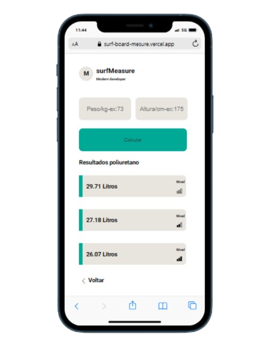

# Project title

App weather

# Tools used

 
 
Javascript + html + css

# Description

Application with the idea of solving the problem of finding your ideal surfboard.
Aplicação ainda em testes com surfistas experientes e shapers renomados como Adriano Teco e Silvio Tico (Silver Surf Brazil).

# How to use

On the initial screen, you must choose the material your board can be made from. To help you with this, the black icon in the corner can help you by providing information about each material.
On the main screen, enter your weight in kilograms and your height in centimeters, click on the calculate button and the ideal weight for your board should be displayed in three levels.
The levels are shown with three bars where the empty bar is the beginner level, two bars of the three full bars lead to the intermediate level and the three full bars lead to the advanced level.

---

**Screen 01 📷**

# 

**Screen 02 📷**

# 

# Installation

`git clone https://github.com/ivanmartins090317/surfBoardMesure.git`

`cd surfBoardMesure`

_in vscode navigate to src/index.html, right click and navigate to open with live server._

# Improvements

- Insert more user interactions.
- Improve color contrast.
- Cache latest searches.
- Download or send document.

# project on Vercel.com:

https://surf-board-mesure.vercel.app/index.html
